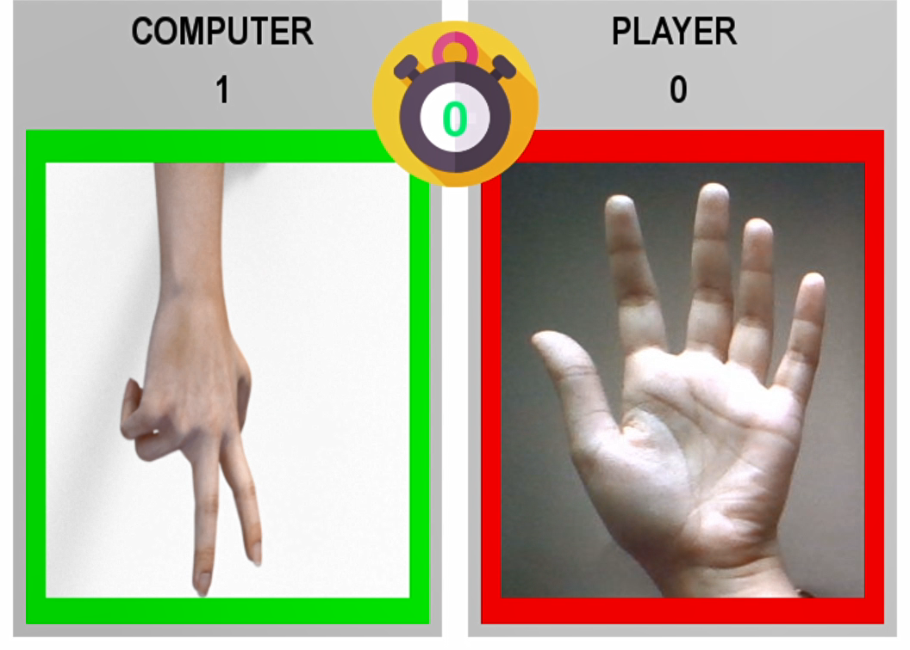
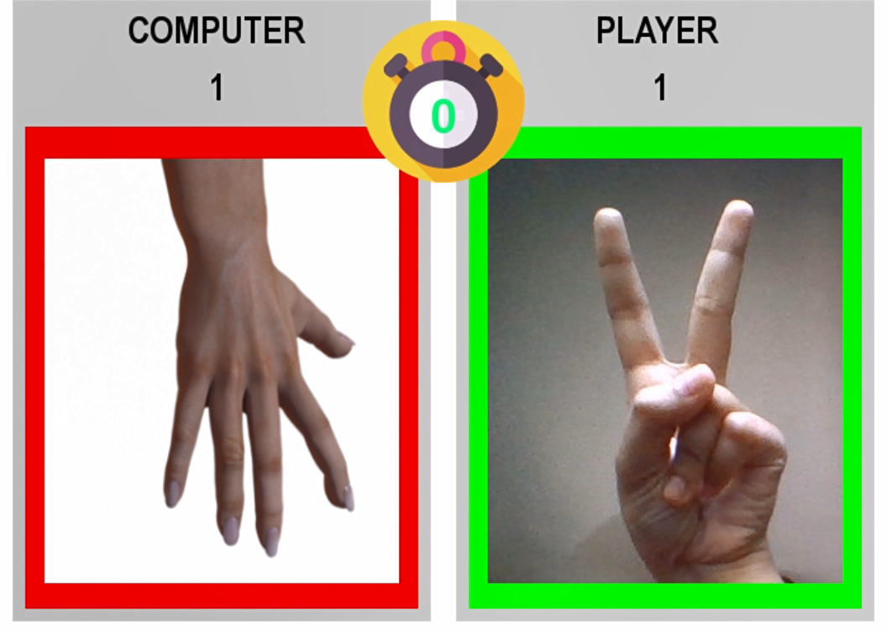
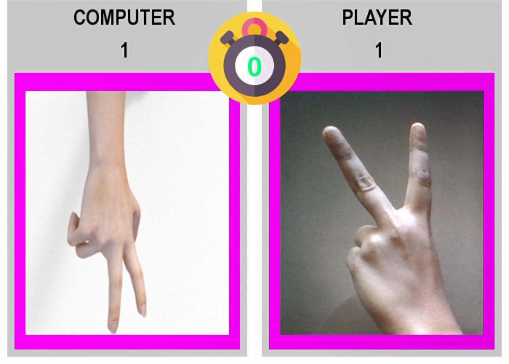
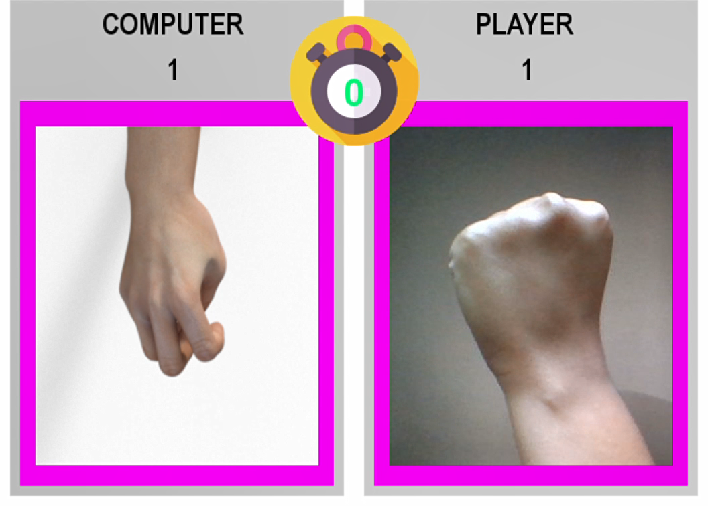
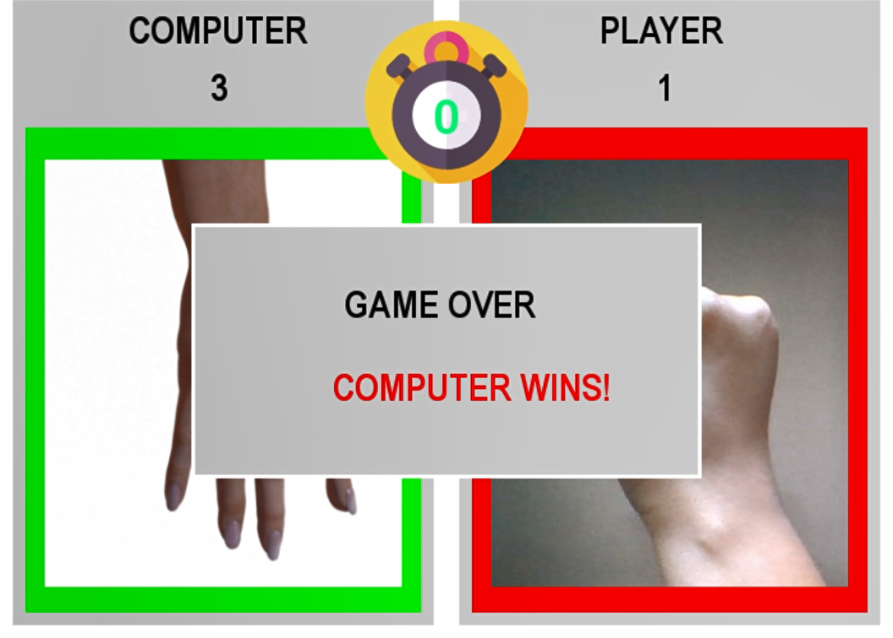
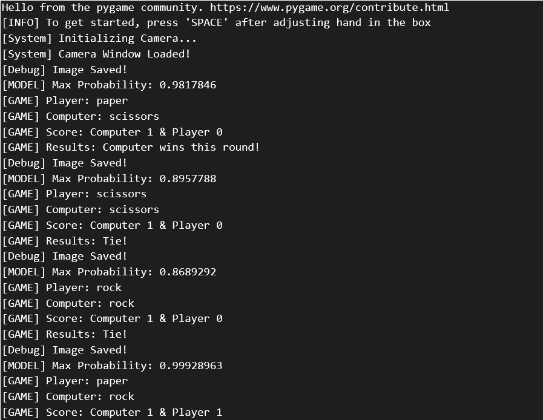

<!-- @format -->

# Rock-Paper-Scissors 

A Rock-Paper-Scissors <b>Pygame</b> with a <b>CNN Multiclass Classifier</b> model built in Keras to recognize real-time hand gestures using <b>OpenCV</b>.

## Working Demo


## Overview

This game simply uses your computer's camera to capture realtime gestures of your hand.

The pictures taken by the camera are processed and fed to a CNN Multi-class image classifier that determines whether the gesture corresponds to "Rock", "Paper" or "Scissors" gesture.

This CNN model is made in keras. You can download the pretrained model from <a href="https://drive.google.com/file/d/1zdw4XDrVhwxIXhiKoULb5Aq9soPvxr0o/view?usp=sharing">here</a> & the dataset from <a href="https://drive.google.com/file/d/1WvVytiOvN7dHT6bydG28rVxJqyf8F1NE/view?usp=sharing">this</a> drive link.

## Prologue

After completing a couple of CNN courses on coursera I wanted to hone my skills by focusing on a small project. So I found 2 useful datasets and jumped straight into building my model. I didnt want to stop there... this led me to create my first pygame. I'm happy with my progress and would like to share it with you.

## Getting Started

**1. Clone the repository**

```bash
git clone <this_repo_url>
```

**2. Start a virtual environment eg. conda (Recommended)**

```bash
conda activate <my_virtual_env>
```

**3. Download the requirements**

```bash
cd Rock-Paper-Scissors-OpenCV
pip install requirements.txt
```

**4. Download the model**

```bash
.
├───models                      # model.h5 files here
├───notebooks
│   └───.ipynb_checkpoints
├───readme_requirements
│   └───video
├───src
│   ├───components
│   │   └───__pycache__
│   └───utils
│       ├───images
│       └───__pycache__
└───tests
    ├───integration
    └───unit
```

**5. Run the game**

```bash
python src/main.py
```

## Outputs

Round 1             |  Round 2             |  Round 3              |
:-------------------------:|:-------------------------:|:-------------------------:
 |  | 
Round 4             |  Round 5             |  Round 6              |
 |  | 

Command Line Output          |
:----------------------------:
 |

## Task List

- [x] Create a CNN Multi-Class Classifier
- [x] Integrate it with OpenCV
- [x] Create my 1st Pygame
- [x] Structure Code!
- [x] Work more on the model
- [x] Fix bugs & Add comments to code

## References

CNN Links :

<ul>
<li>The best way to get started -> <a href="https://www.coursera.org/learn/convolutional-neural-networks/">Convolutional Neural Networks by Andrew Ng</a>
</ul>

Pygame Links :

<ul>
<li><a href="https://www.pygame.org/docs/">Pygame Docs</a> or even this <a href="https://pygame.readthedocs.io/">Pygame Guide</a></li>
<li><a href="https://www.101computing.net/getting-started-with-pygame/">A Basic Pygame Tutorial</a></li>
</ul>

## License

[](https://opensource.org/licenses/MIT)

[MIT License Link](https://github.com/Darlene-Naz/Rock-Paper-Scissors-OpenCV/blob/master/LICENSE)


© 2020 Darlene Nazareth
